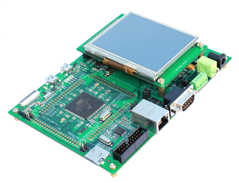

.. _devkit1207_f207ig_board:

ST Devkit1207 F207IG
####################

Overview
********

The Devkit1207 F207IG board features an ARM Cortex-M3 based STM32F207IG MCU
with a wide range of connectivity support and configurations. Here are
some highlights of the Nucleo F207IG board:

- STM32 microcontroller in LQFP144 package
- Ethernet compliant with IEEE-802.3-2002
- Two types of extension resources:

  - ST Zio connector including: support for Arduino* Uno V3 connectivity
    (A0 to A5, D0 to D15) and additional signals exposing a wide range of
    peripherals
  - ST morpho extension pin headers for full access to all STM32 I/Os

- On-board ST-LINK/V2-1 debugger/programmer with SWD connector
- Flexible board power supply:

  - 5 V from ST-LINK/V2-1 USB VBUS
  - External power sources: 3.3 V and 7 - 12 V on ST Zio or ST morpho
    connectors, 5 V on ST morpho connector

- Four user LEDs
- Two push-buttons: USER and RESET

More information about the board can be found at the `Devkit1207 F207IG website`_.

Hardware
********

Devkit1207 F207IG provides the following hardware components:

- STM32F207IGT6 in LQFP144 package
- ARM |reg| 32-bit Cortex |reg| -M3 CPU
- 120 MHz max CPU frequency
- VDD from 1.7 V to 3.6 V
- 1 MB Flash
- 128 KB SRAM
- GPIO with external interrupt capability
- 12-bit ADC with 24 channels
- RTC
- 17 General purpose timers
- 2 watchdog timers (independent and window)
- SysTick timer
- USART/UART (6)
- I2C (3)
- SPI (3)
- SDIO
- USB 2.0 OTG FS
- DMA Controller
- 10/100 Ethernet MAC with dedicated DMA
- CRC calculation unit
- True random number generator

More information about STM32F207IG can be found here:

- `STM32F207IG on www.st.com`_
- `STM32F207 reference manual`_

Supported Features
==================

The Zephyr devkit1207_207ig board configuration supports the following hardware features:

+-----------+------------+-------------------------------------+
| Interface | Controller | Driver/Component                    |
+===========+============+=====================================+
| NVIC      | on-chip    | nested vector interrupt controller  |
+-----------+------------+-------------------------------------+
| UART      | on-chip    | serial port-polling;                |
|           |            | serial port-interrupt               |
+-----------+------------+-------------------------------------+
| PINMUX    | on-chip    | pinmux                              |
+-----------+------------+-------------------------------------+
| GPIO      | on-chip    | gpio                                |
+-----------+------------+-------------------------------------+
| ETHERNET  | on-chip    | Ethernet                            |
+-----------+------------+-------------------------------------+
| USB       | on-chip    | USB device                          |
+-----------+------------+-------------------------------------+

Other hardware features are not yet supported on this Zephyr port.

The default configuration can be found in the defconfig file:
``boards/arm/nucleo_f207zg/nucleo_f207zg_defconfig``

Connections and IOs
===================

Devkit1207 F207IG Board has 8 GPIO controllers. These controllers are responsible for pin muxing,
input/output, pull-up, etc.

Default Zephyr Peripheral Mapping:
----------------------------------

- ETH : PA1, PA2, PA7, PB13, PC1, PC4, PC5, PG11, PG13
- USB_DM : PA11
- USB_DP : PA12
- USER_PB : PC13
- LD1 : PB0
- LD2 : PB7
- LD3 : PB14

System Clock
------------

Devkit1207 F207IG System Clock could be driven by internal or external oscillator,
as well as main PLL clock. By default System clock is driven by PLL clock at 120MHz,
driven by 8MHz high speed external clock.

Serial Port
-----------

Devkit1207 F207IG board has 4 UARTs. The Zephyr console output is assigned to UART3.
Default settings are 115200 8N1.

Network interface
-----------------

Ethernet configured as the default network interface

USB
---
Devkit1207 F207IG board has a USB OTG dual-role device (DRD) controller that
supports both device and host functions through its micro USB connector
(USB USER). Only USB device function is supported in Zephyr at the moment.

Programming and Debugging
*************************

Devkit1207 F207IG board includes an ST-LINK/V2-1 embedded debug tool interface.
This interface is supported by the openocd version included in Zephyr SDK.

.. _Devkit1207 F207IG website:
   http://www.st.com/en/evaluation-tools/nucleo-f207zg.html

.. _STM32F207IG on www.st.com:
   http://www.st.com/en/microcontrollers/stm32f207ig.html

.. _STM32F207 reference manual:
   http://www.st.com/resource/en/reference_manual/cd00225773.pdf
